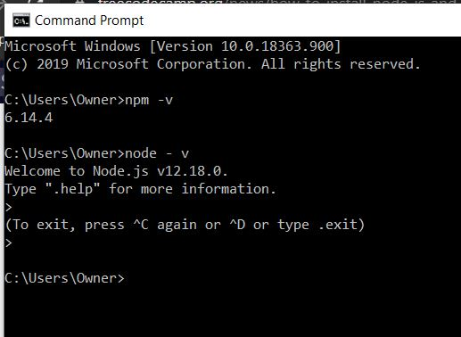
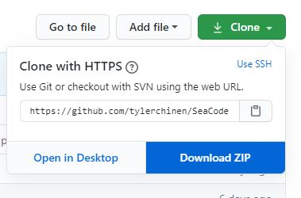
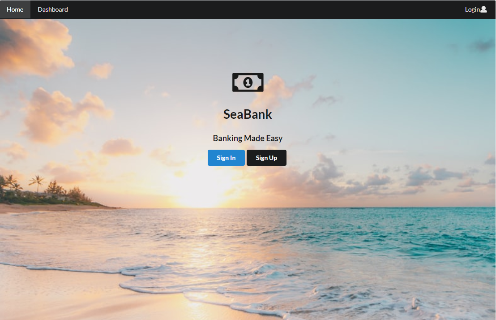
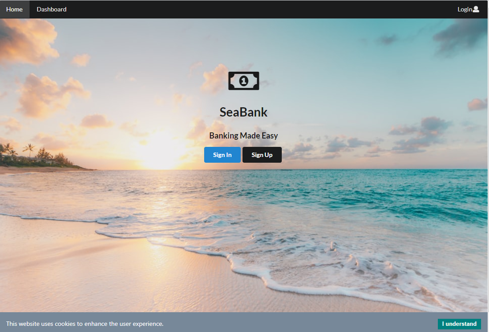
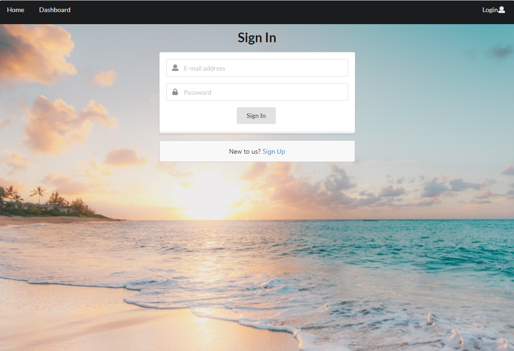
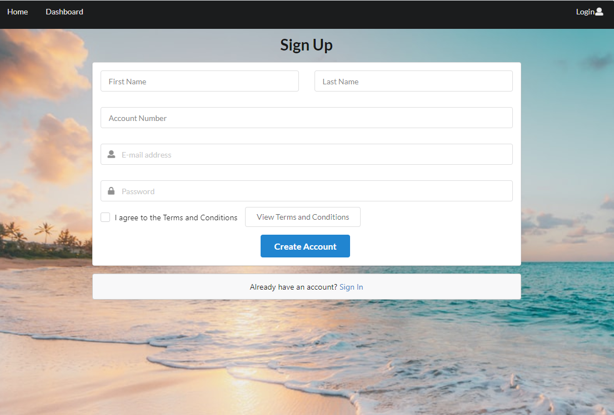
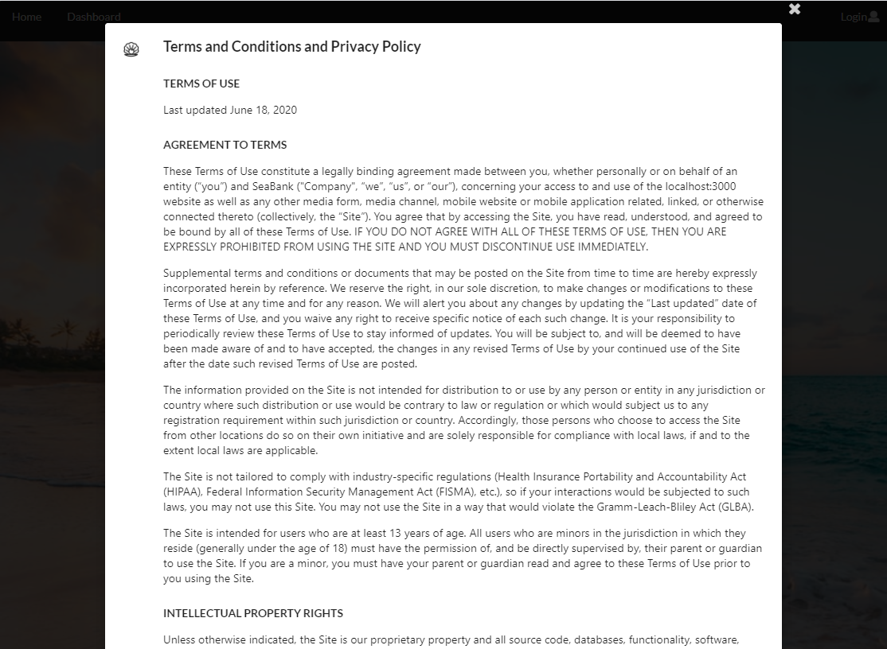
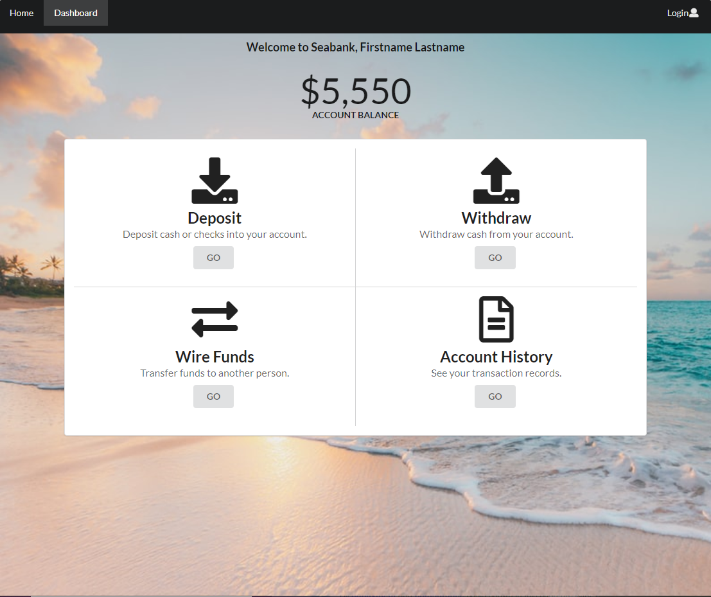

# SeaBank 
## Table of Contents

1. [Overview](#overview)
2. [User Guide](#user-guide)
3. [Contact Us](#contact-us)

## Overview

SeaBank is a web-based banking application for a fictitious currency. It includes features that allow users to create an account, sign in, deposit, withdraw, check their balance, wire transfer, and view their account history.

The GitHub Repository for our application can be found **[here](https://github.com/tylerchinen/SeaCode-Bank-WebApp).**

## User Guide
### Specifications for Use
To run our application you will need to have an IDE downloaded that is compatible with Javascript (we recommend IntelliJ Idea or Visual Studio Code), you will also need to download NPM, and Node.js.

1. You will need an IDE in order to access the code for our application and to ultimately run it. 
   - **Intellij Idea**
     - If you are a student you can sign up for a [JetBrains student license here](https://www.jetbrains.com/community/education/#students) which will allow you to obtain a free student license for IntelliJ Idea.
       - Next you will need to [download IntelliJ Idea](https://www.jetbrains.com/idea/download/#section=windows). [Here are more specific instructions for installation](http://courses.ics.hawaii.edu/ics314s19/morea/development-environments/experience-install-intellij-idea.html)
   - **Visual Studio Code**
     - Visual Studio Code is free to download and [instructions can be found here](https://code.visualstudio.com/docs/setup/windows).

2. After you have an IDE that is compatible with Javascript you will need to download NPM and node.js in the terminal/command prompt. [Instructions can be found here](https://www.npmjs.com/get-npm).
   - After installation you can use ``` node -v ``` and ``` node -v ``` in the terminal/command prompt to ensure that they are both installed. The result should be the version that is downloaded.
   

3. Once you have the proper tools installed you will then need to download our code from our [GitHub](https://github.com/tylerchinen/SeaCode-Bank-WebApp).
   
   - 

4. 
```
npm install
```


```
npm start
```


#### Home Page & Cookies

<p>
When you first visit our site you are taken to the home page, where you can read a brief description about Manoa Study Hub as well as some of the functionalities that our site can provide. From this page you are able to use the Login button which presents you with a dropdown menu that allows you to either sign in or sign up for a new account.
</p>



#### Sign-In Page


#### Sign-Up Page & Terms and Conditions




#### Dashboard


- #### Deposit


- #### Withdraw


- #### Wire Funds


- #### Account History


## Contact Us

### Group Members

#### Patima Poochai
ppoochai@hawaii.edu

#### Tyler Chinen
tlc852@hawaii.edu

#### Mirabela Medallon
mirabela@hawaii.edu

#### Wei Leong Hiew
hiew@hawaii.edu
