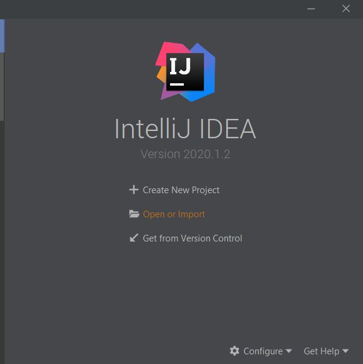

# SeaBank 
## Table of Contents

1. [Overview](#overview)
2. [User Guide](#user-guide)
   2. [Specifications for Use](#specifications-for-use)
   2. [Features](#features)
3. [Contact Us](#contact-us)

## Overview

SeaBank is a web-based banking application for a fictitious currency. It includes features that allow users to create an account, sign in, deposit, withdraw, check their balance, wire transfer, and view their account history.

The GitHub Repository for our application can be found **[here](https://github.com/tylerchinen/SeaCode-Bank-WebApp).**

## User Guide
### Specifications for Use
To run our application you will need to have an IDE downloaded that is compatible with Javascript (we recommend IntelliJ Idea or Visual Studio Code), you will also need to download NPM, and Node.js.

1. You will need an IDE in order to access the code for our application and to ultimately run it. 
   - **Intellij Idea**
     - If you are a student you can sign up for a [JetBrains student license here](https://www.jetbrains.com/community/education/#students) which will allow you to obtain a free student license for IntelliJ Idea.
       - Next you will need to [download IntelliJ Idea](https://www.jetbrains.com/idea/download/#section=windows). [Here are more specific instructions for installation](http://courses.ics.hawaii.edu/ics314s19/morea/development-environments/experience-install-intellij-idea.html)
   - **Visual Studio Code**
     - Visual Studio Code is free to download and [instructions can be found here](https://code.visualstudio.com/docs/setup/windows).

2. After you have an IDE that is compatible with Javascript you will need to download NPM and node.js in the terminal/command prompt. [Instructions can be found here](https://www.npmjs.com/get-npm).
   - After installation you can use ``` node -v ``` and ``` node -v ``` in the terminal/command prompt to ensure that they are both installed. The result should be the version that is downloaded.
   

3. Once you have the proper tools installed you will then need to download our code from our [GitHub](https://github.com/tylerchinen/SeaCode-Bank-WebApp) by clicking the *clone* button and then either *download in Desktop* or *download zip*. Depending on which IDE you chose the instruction differ slightly as follows:
   
   - If you wish to use **download in desktop** you will need to [download GitHub Desktop](https://desktop.github.com/). Although this takes an extra step it will make accessing the code much easier. 
   - Once you have GitHub Desktop downloaded you will be able to *clone* and *download in desktop* which will open the GitHub Desktop.
   -  Next you will need to open either *IntelliJ Idea* or *Visual Studio Code*
      - **IntelliJ Idea**
      
          - Select *Open or Import* or just *File | Open* if IntelliJ is already open. 
          - Next you will need to navigate to the GitHub folder in your computer then the project folder which should be called *SeaCode-Bank-WebApp*.
          - Once selected you should be able to open the code view the entire framework of our application.
        
      - **Visual Studio Code**
        - Visual Studio will not require GitHub however, it makes finding the project much easier if you have already cloned and opened it GitHub Desktop.
        - Similarly to IntelliJ you can navigate to *File| Open File |* then you will need to locate the GitHub folder in our computer then find the project folder labeled *SeaCode-Bank-WebApp*
        - Once selected you should be able to open the code view the entire framework of our application.
   
   
   
   - If you wish to use **download zip**
     - You will need to [unzip the file](https://www.windowscentral.com/how-zip-and-unzip-files-windows-10) to your location of choice.
     -  Next you will need to open either *IntelliJ Idea* or *Visual Studio Code*
      - **IntelliJ Idea**
      
          - Select *Open or Import* or just *File | Open* if IntelliJ is already open. 
          - Next you will need to navigate to the folder/ location that you saved the unzipped file to then into the project folder which should be called *SeaCode-Bank-WebApp*.
          - Once selected you should be able to open the code view the entire framework of our application.
        
      - **Visual Studio Code**
        - Similarly to IntelliJ you can navigate to *File | Open File |* then you will need to navigate to the folder/ location that you saved the unzipped file to then into the project folder which should be called *SeaCode-Bank-WebApp*.
        - Once selected you should be able to open the code view the entire framework of our application.

4. Now that you are able to access the project code locally you should be able to open the built-in terminals within the IDEs through
   - **IntelliJ Idea** - *View | Tools Window | Terminal* (IntelliJ may require an external 
     

   - **Visual Studio Code** - *View | Terminal*
     
     
5. With the terminal in the IDE that you have chosen you will need to navigate into the *webapp* folder by using the ```cd webapp``` command (this will open the frontend of our application).
   
    
   - Then you will be need to run ```npm install``` after this completes you will need to run ```npm start```
   - Once this completes the application should open in the *localhost:3000* 

6. Once again, within the terminal in the IDE that you have chosen you will now need to add another terminal tab by using the *'+'* button (both are similar in either IntelliJ or Visual Studio. Then you will need to navigate into the *backend* folder by using the ```cd backend``` command (this will open the backend of our application).
   
    
   - Then you will be need to run ```npm install``` again and after this completes you will need to run ```npm start```
   - Once this completes the terminal should prompt you stating that the *localhost:3000* is busy, select 'y' to allow the application to run on another host number.
   - You should now have our application up and running - Happy Banking!


## Features
#### Home Page & Cookies

<p>
When you first visit our site you are taken to the home page. From this page you are able to use the Sign in or Sign Up buttons or you can use the dropdown menu in the upper right hand corner to do the same.
</p>

<p>
The first time you visit the home page you may notice the cookies pop-up prompt at the bottom of the screen. Once you click the *I understand* button the prompt will not show again.
</p>

#### Sign-In Page

<p>
On the sign-in page you are prompted to enter your email and password, and if you do not have an account you are able to click on the link that will re-route you to the Sign Up page. 
</p>

#### Sign-Up Page & Terms and Conditions

<p>
In order to sign up you must fill out the field prompts and accept the terms and conditions. Additionally if you click on the *View Terms and Conditions* button you are able to see the terms in a pop-up window as shown below. 
</p>


#### Dashboard

<p>
Upon successfully signing in or signing up you are re-routed to the dashboard which presents you with the functionalities available within our banking system. These functionalities include being able to deposit, withdraw, and wire funds as well as view your account history. 
</p>

- #### Deposit
<p></p>

- #### Withdraw
<p></p>

- #### Wire Funds
<p></p>

- #### Account History
<p></p>


## Contact Us

### Group Members

#### Patima Poochai
ppoochai@hawaii.edu

#### Tyler Chinen
tlc852@hawaii.edu

#### Mirabela Medallon
mirabela@hawaii.edu

#### Wei Leong Hiew
hiew@hawaii.edu
